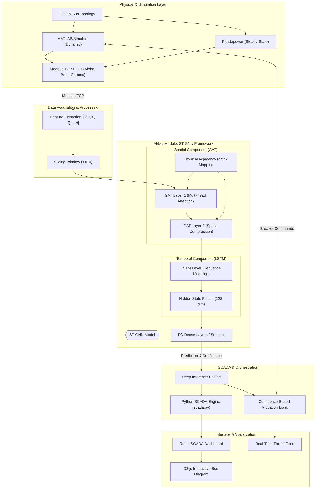

# Vertex Fusion: ST-GNN & SCADA Framework Block Diagram

## Cyber-Physical Architecture

This diagram illustrates the flow from data acquisition in the physical power grid to high-level AI detection and real-time SCADA visualization.

## Component Descriptions

### 1. Physical & Simulation Layer
*   **Grid Topology**: The system operates on the standard IEEE 9-bus benchmark for transmission network analysis.
*   **Dual-Engine Co-Simulation**: 
    *   **MATLAB/Simulink**: Handles transient stability and dynamic response.
    *   **Pandapower**: Provides steady-state power flow verification.
*   **Modbus TCP PLCs**: Three virtual PLC nodes (`Alpha`, `Beta`, `Gamma`) simulate distributed network controllers.

### 2. AI/ML Module (ST-GNN Framework)
*   **Spatio-Temporal Fusion**: Unlike standard ML, this framework processes **spatial** (topology-aware) and **temporal** (sequence-aware) data simultaneously.
*   **Graph Attention (GAT)**: Focuses on the most topologically significant neighbors during a disturbance.
*   **LSTM Backbone**: Analyzes a sliding window of the last 10 grid states to identify subtle attack ramps.

### 3. SCADA & Mitigation
*   **Inference Engine**: Evaluates grid health in <15ms.
*   **Autonomous Logic**: Decides whether to issue an alarm or isolate specific buses (Selective Trip) based on AI confidence.

### 4. Interface & Visualization
*   **D3.js Bus Diagram**: A dynamic, real-time representation where cyber-physical state changes are reflected instantly for human operators.
